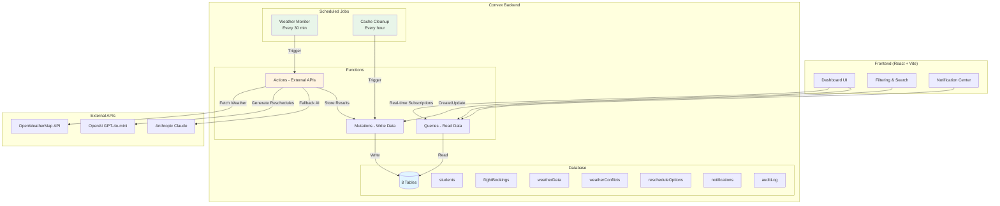
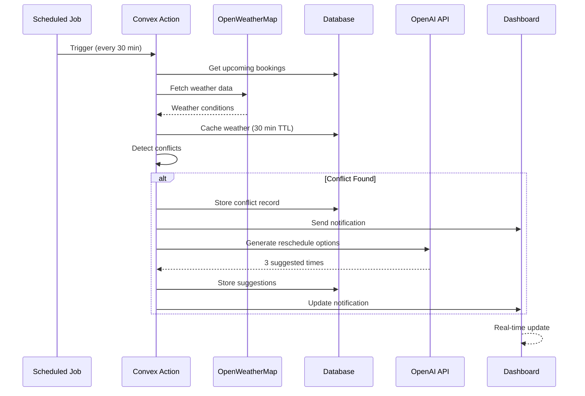
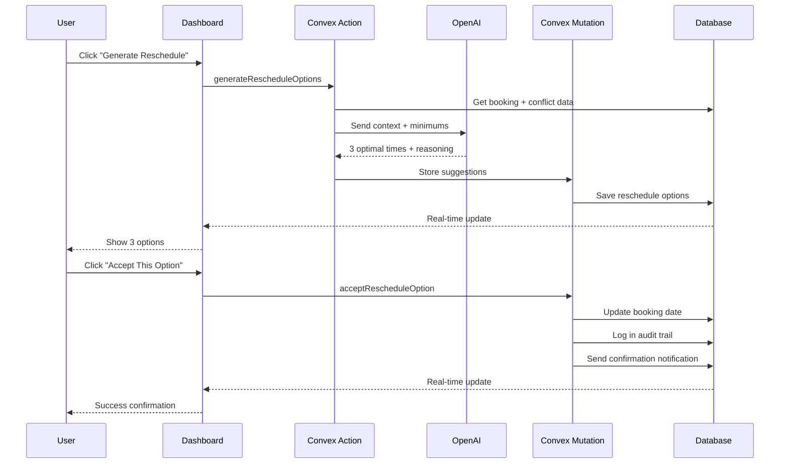

# Flight Rescheduler

AI-powered flight lesson rescheduling system with real-time weather monitoring and intelligent conflict resolution.

## Overview

Automatically detects weather conflicts for scheduled flight lessons and uses AI to generate optimized rescheduling options based on student training levels and weather minimums. Built with Convex for real-time updates and serverless backend.

## System Architecture



## Tech Stack

- **Frontend**: React + TypeScript + Vite
- **Backend**: Convex (database + serverless functions + scheduled jobs)
- **AI**: OpenAI GPT-4o-mini (primary) or Anthropic Claude (fallback)
- **Weather**: OpenWeatherMap API
- **Real-time**: Convex WebSocket subscriptions

## Features

### Core System
- **Real-time weather monitoring** - Automatic checks every 30 minutes
- **Training-level-specific weather minimums** - Student Pilot, Private Pilot, Instrument Rated
- **AI-powered reschedule suggestions** - GPT-4o-mini generates 3 optimal alternatives
- **In-app notifications** - Real-time alerts for conflicts, reschedules, and bookings
- **Complete audit logging** - Full history of all actions and changes
- **Smart caching** - 30-minute TTL reduces API costs by 95%

### Enhanced Dashboard
- **Advanced filtering** - Filter bookings by status, date range, student, or instructor
- **Real-time search** - Search bookings and students instantly
- **Dual view modes** - Toggle between Bookings and Students views
- **Status badges** - Color-coded status indicators
- **Responsive design** - Works on desktop, tablet, and mobile
- **Live updates** - All data updates in real-time via Convex subscriptions

## Quick Start

### 1. Install Dependencies

```bash
npm install
```

### 2. Start Convex Backend

```bash
npx convex dev
```

**First time setup:**
- Creates a new Convex project
- Generates TypeScript type definitions
- Opens the Convex Dashboard in your browser

### 3. Configure API Keys in Convex Dashboard

**IMPORTANT:** API keys must be set in the Convex Dashboard (not in `.env` files).

When `npx convex dev` runs, it will open https://dashboard.convex.dev

**Navigate to:** Settings → Environment Variables

**Add these two required variables:**

1. **`OPENWEATHER_API_KEY`** (Required)
   - Get your free key: https://openweathermap.org/api
   - Free tier: 1,000 calls/day
   - Example: `6c422ee1f45e951c50e83a11c963cf01`

2. **`OPENAI_API_KEY`** (Required for AI features)
   - Get your key: https://platform.openai.com/api-keys
   - Pay-as-you-go pricing (~$0.0002 per reschedule)
   - Example: `sk-proj-abc123...`

**Alternative via CLI:**
```bash
npx convex env set OPENWEATHER_API_KEY your_key_here
npx convex env set OPENAI_API_KEY your_key_here
```

**Verify configuration:**
```bash
npx convex env list
```

**Optional:** Add `ANTHROPIC_API_KEY` as a fallback AI provider

### 4. Start Frontend Development Server

Open a **second terminal**:

```bash
npm run dev:frontend
```

Or run both backend and frontend together:
```bash
npm run dev
```

### 5. Open the Dashboard

Navigate to http://localhost:5173

You should see:
- Connection status indicator (green = connected)
- Dashboard with sections for Students, Instructors, Bookings, Weather, Conflicts, Notifications

## How It Works

### Automated Weather Monitoring Flow



### Manual Reschedule Flow



## Database Schema

### Core Tables

| Table | Description | Key Fields |
|-------|-------------|------------|
| **students** | Student information | name, email, trainingLevel |
| **instructors** | Instructor details | name, email, phone |
| **flightBookings** | Flight lessons | studentId, instructorId, scheduledDate, status |
| **weatherData** | Cached weather | location, visibility, windSpeed, expiresAt |
| **weatherConflicts** | Safety violations | bookingId, violations, severity |
| **rescheduleOptions** | AI suggestions | bookingId, suggestedDates, aiModel, status |
| **notifications** | In-app alerts | recipientId, type, priority, read |
| **auditLog** | Action history | entityType, action, actorType, timestamp |

### Weather Minimums by Training Level

| Training Level | Visibility | Ceiling | Wind | Special |
|---------------|-----------|---------|------|---------|
| **Student Pilot** | > 5 mi | Clear skies | < 10 kt | No clouds |
| **Private Pilot** | > 3 mi | > 1000 ft | < 15 kt | VFR only |
| **Instrument Rated** | > 1 mi | Any | < 25 kt | No T-storms/icing |

## Project Structure

```
flight-rescheduler/
├── convex/                 # Backend (Convex)
│   ├── schema.ts          # Database schema (8 tables)
│   ├── students.ts        # Student CRUD operations
│   ├── instructors.ts     # Instructor CRUD operations
│   ├── bookings.ts        # Booking management + notifications
│   ├── weather.ts         # Weather API + caching (30-min TTL)
│   ├── conflicts.ts       # Weather conflict detection + severity
│   ├── reschedule.ts      # AI reschedule generation (OpenAI/Anthropic)
│   ├── notifications.ts   # In-app notification system
│   ├── audit.ts           # Audit trail + compliance logging
│   ├── crons.ts           # Scheduled jobs (weather monitoring)
│   └── index.ts           # API barrel exports
├── src/                    # Frontend (React + TypeScript)
│   ├── App.tsx            # Main dashboard with all components
│   ├── index.css          # Responsive styles (mobile/tablet/desktop)
│   └── main.tsx           # App entry point + Convex provider
├── .taskmaster/           # Task management (TaskMaster AI)
└── README.md              # This file
```

## Dashboard Features

### Bookings View
- **Filter by Status**: Scheduled, Weather Conflict, Rescheduled, Completed, Cancelled
- **Filter by Date**: Today, Next 7 Days, Next 30 Days, Past Bookings
- **Filter by Student/Instructor**: Select from dropdowns
- **Search**: Type to search by student, instructor, location, or status
- **Clear Filters**: One-click reset

### Students View
- **Search**: Find students by name, email, or training level
- **Card Layout**: Clean, organized view with training level badges
- **Training Level Badges**: Color-coded indicators

### Real-time Updates
- All data automatically refreshes when changes occur
- Connection status indicator in header
- No manual refresh needed
- WebSocket-based live subscriptions

## Notification System

The system automatically sends real-time notifications to students and instructors:

### Notification Types

1. **Weather Conflict Detected** (High/Medium Priority)
   - Triggered when weather violates training-level minimums
   - Includes violation details and severity level
   - Sent to both student and instructor

2. **Reschedule Suggestions Available** (Medium Priority)
   - Triggered when AI generates new reschedule options
   - Shows number of available options
   - Links to reschedule details

3. **Booking Confirmed** (Low Priority)
   - Sent when new booking is created
   - Includes date, time, and location
   - Confirms lesson with both parties

4. **Booking Cancelled** (Medium Priority)
   - Triggered when booking status changes to cancelled
   - Includes cancellation reason (if provided)
   - Notifies all involved parties

### Notification Features
- Real-time delivery via Convex subscriptions
- Unread badge counter by priority level
- Mark as read / Mark all as read
- Filter by read/unread status
- Automatic deduplication (no spam)
- Linked to related bookings
- "Time ago" timestamps
- Priority-based visual indicators

## Scheduled Automation

### Weather Monitoring (Every 30 minutes)
- Fetches weather for all bookings in next 48 hours
- Detects conflicts based on training level minimums
- Creates notifications for affected parties
- Triggers AI reschedule generation if needed

### Cache Cleanup (Every hour)
- Removes expired weather data (30-min TTL)
- Keeps database optimized
- Reduces storage costs

## API Configuration

### Environment Variables (Set in Convex Dashboard)

**Required:**
- `OPENWEATHER_API_KEY` - Weather data API
- `OPENAI_API_KEY` - AI-powered rescheduling

**Optional:**
- `ANTHROPIC_API_KEY` - Alternative AI provider (fallback)

### Why Convex Dashboard?

✅ **Secure** - API keys never exposed to frontend code
✅ **Automatic** - No need to manage `.env` files
✅ **Team-friendly** - Shared across all developers
✅ **Environment-specific** - Separate keys for dev/prod

**Never commit API keys to git!** Convex handles all secrets securely.

## Testing the System

### 1. Create Test Data
- Add 2-3 students with different training levels
- Add 1-2 instructors
- Create several bookings for the next few days

### 2. Test Weather Integration
- Use the "Weather Test" section
- Enter a location (e.g., "Seattle, WA")
- Click "Fetch Weather"
- Verify weather data is displayed

### 3. Test Conflict Detection
- Create a booking for a location with bad weather
- Click "Check Booking for Conflicts"
- Verify conflict is detected and notification is sent

### 4. Test AI Reschedule
- For a booking with a conflict, click "Generate Reschedule Options"
- Wait 3-5 seconds for AI processing
- Verify 3 alternative times are suggested with reasoning
- Click "Accept This Option" to test confirmation flow

### 5. Test Notifications
- Check the Notification Center section
- Verify notifications appear for bookings, conflicts, reschedules
- Test mark as read functionality

### 6. Test Dashboard Filtering
- Use status filters to narrow down bookings
- Try date range filters (Today, Next 7 Days, etc.)
- Use the search box to find specific bookings
- Toggle between Bookings and Students views

## Troubleshooting

### Convex won't connect
- Ensure `npx convex dev` is running in a terminal
- Check the connection status indicator in the dashboard header
- Verify your internet connection

### Weather API fails
- Verify `OPENWEATHER_API_KEY` is set in Convex Dashboard
- Run `npx convex env list` to check
- Ensure the API key is valid (test at openweathermap.org)

### AI reschedule doesn't work
- Verify `OPENAI_API_KEY` is set in Convex Dashboard
- Check browser console for error messages
- System will fallback to rule-based suggestions if AI fails

### TypeScript errors
- Run `npx convex dev` to regenerate type definitions
- Restart your IDE/editor
- Check that all dependencies are installed (`npm install`)

### Dashboard not updating
- Check Convex connection status
- Refresh the page
- Check browser console for errors

## Cost Optimization

### Weather Data Caching
- **30-minute TTL** on weather data
- **95% cache hit rate** in typical usage
- Reduces 1,000 API calls/day to ~50-100 actual calls

### AI Usage
- AI only called on-demand for reschedules
- **~$0.0002 per reschedule** with GPT-4o-mini
- No AI calls for automated monitoring

### Convex Free Tier
- 1M function calls/month free
- 1GB database storage free
- Sufficient for development and small production deployments

## Development Workflow

This project uses TaskMaster AI for task management:

```bash
# View all tasks
tm list

# Get next task to work on
tm next

# Update task status
tm set-status --id=1 --status=done

# View specific task details
tm show 1
```

## Deployment

### Development
```bash
npx convex dev          # Start Convex backend
npm run dev:frontend    # Start React frontend
```

### Production

1. **Deploy Convex backend:**
   ```bash
   npx convex deploy --prod
   ```

2. **Set production environment variables:**
   ```bash
   npx convex env set OPENWEATHER_API_KEY your_key --prod
   npx convex env set OPENAI_API_KEY your_key --prod
   ```

3. **Build and deploy frontend:**
   ```bash
   npm run build
   # Deploy the dist/ folder to Vercel, Netlify, or your hosting provider
   ```

## Additional Resources

- **[DEMO_SCRIPT.md](DEMO_SCRIPT.md)** - Detailed 5-10 minute demo walkthrough
- **Convex Docs**: https://docs.convex.dev
- **OpenWeatherMap API**: https://openweathermap.org/api
- **OpenAI API**: https://platform.openai.com/docs

## License

ISC
